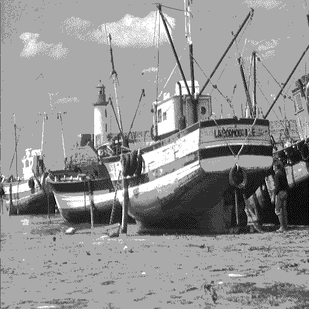
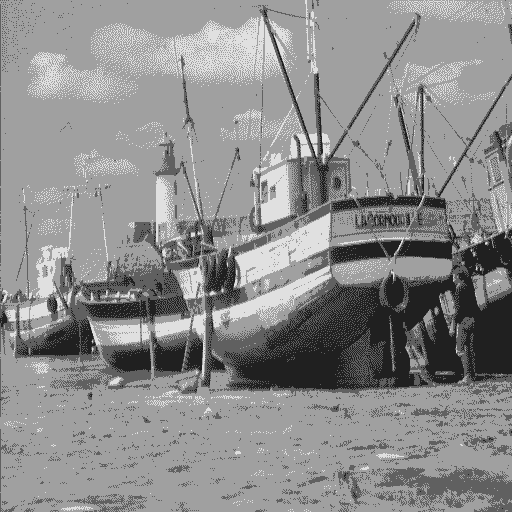

> Developed with [Giuseppe Marino](https://github.com/giuseppe16180)

## Dithering

[Dithering](https://en.wikipedia.org/wiki/Dither) is a technique used to apply noise to an image in such a way that it tricks the human eye, improving the final quality. This implementation contains two versions, [Floyd-Steinberg](https://en.wikipedia.org/wiki/Floyd–Steinberg_dithering)'s and [Omohundro](https://omohundro.files.wordpress.com/2009/03/omohundro90_floyd_steinberg_dithering.pdf)'s.

### Usage

Both functions take two parameters, a grayscale image and the number of shades of gray to perform dithering.

```matlab
f = floydsteinberg(img, 4);
figure; imshow(uint8(f));

o = omohundro(img, 4);
figure; imshow(uint8(o));
```

<p align="center">
  
  
</p>

> `imshow(uint8(f))` (left)
>
> `imshow(uint8(o))` (right)
